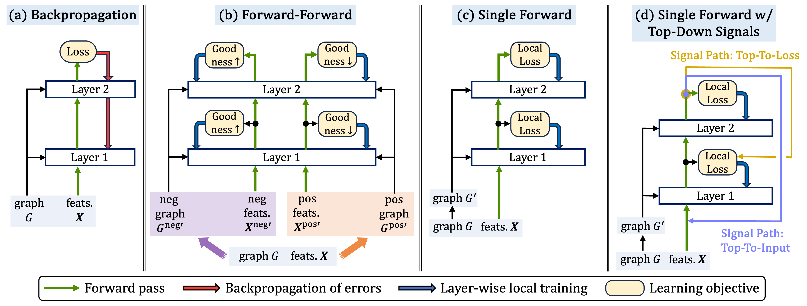

# Forward Learning of Graph Neural Networks
This repository provides the code of the ForwardGNN framework presented in the paper ["Forward Learning of Graph Neural Networks"](https://arxiv.org/pdf/2403.11004.pdf), 
Namyong Park, Xing Wang, Antoine Simoulin, Shuai Yang, Grey Yang, Ryan Rossi, Puja Trivedi, Nesreen Ahmed, 
The Twelfth International Conference on Learning Representations (ICLR) 2024.
<div align="center">

</div>

***Learning graph neural networks (GNNs) with (a) backpropagation and (b)-(d) the proposed forward learning approaches of the ForwardGNN framework**:
(a) Backpropagation involves one forward pass, followed by one backward pass through the network. 
(b) The forward-forward approach involves two forward passes on positive and negative inputs. 
(c) The single-forward approach learns via just one forward pass. 
(d) The single-forward approach is extended to incorporate top-down signals.*

## Installation
Running [install_packages.sh](install/install_packages.sh) sets up the conda environment named `ForwardLearningGNN` and installs required packages.

## Datasets
Datasets used in the paper will be downloaded in the [`data`](./data/) folder when the code runs for the first time.

## Data Splits
Node and edge splits to be used for node classification and link prediction, respectively, 
will be generated in the [`datasplits`](./datasplits/) folder when the code runs for the first time.
To use the node and edge splits used for the experiments in the paper,
download them from 
[this repository](https://github.com/NamyongPark/forwardgnn-datasplits), and 
place them in the [`datasplits`](./datasplits/) folder.

## How to Run
Scripts in [`exp/nodeclass/`](./exp/nodeclass/) and [`exp/linkpred/`](./exp/linkpred/) can be used 
to train GNNs using the proposed forward learning algorithms of ForwardGNN or backpropagation 
for node classification and link prediction, respectively.

## Directory Structure
* [`src/`](./src/): source code root directory
  * [`src/train_forward.py`](./src/train_forward.py): script to train GNNs using the forward learning algorithms
  * [`src/forward_learning`](./src/forward_learning): root package for the forward learning algorithms
    * [`src/forward_learning/nodeclass`](./src/forward_learning/nodeclass): package for variants of forward learning algorithms for node classification
    * [`src/forward_learning/linkpred`](./src/forward_learning/linkpred): package for variants of forward learning algorithms for link prediction
  * [`src/train_backprop.py`](./src/train_backprop.py): script to train GNNs using backpropagation
  * [`src/gnn`](./src/gnn): package with adapted GNN operators
  * [`src/datasets`](./src/datasets): package with scripts to preprocess and load data and data splits
  * [`src/utils`](./src/utils): package for various utility classes and functions, e.g., performance evaluation, early stopping, and logging.
* [`exp/`](./exp/): directory with scripts to train GNNs using the proposed forward learning algorithms and backpropagation
* [`data/`](./data/): directory to store graph data files
* [`datasplits/`](./datasplits/): directory to store graph data splits

## Citation
If you use code in this repository in your own work, please cite our paper.
```bibtex
@inproceedings{park2024forwardgnn,
  title={Forward Learning of Graph Neural Networks},
  author={Namyong Park and Xing Wang and Antoine Simoulin and Shuai Yang and Grey Yang and Ryan Rossi and Puja Trivedi and Nesreen Ahmed},
  booktitle={ICLR},
  year={2024},
}
```

## License
The majority of the ForwardGNN project is licensed under CC-BY-NC, 
however portions of the project are available under separate license terms.
The GCN and GraphSAGE operators in the [gnn](./src/gnn) folder adapted the PyG's implementation, 
which is licensed under the MIT license.
The forward learning algorithms in the [nodeclass](./src/forward_learning/nodeclass) and [linkpred](./src/forward_learning/linkpred) folders 
build upon the Nebuly's implementation of the forward-forward algorithm, 
which is licensed under the Apache-2.0 license.

## Contributing
See the [CONTRIBUTING](CONTRIBUTING.md) file for how to contribute to the project.